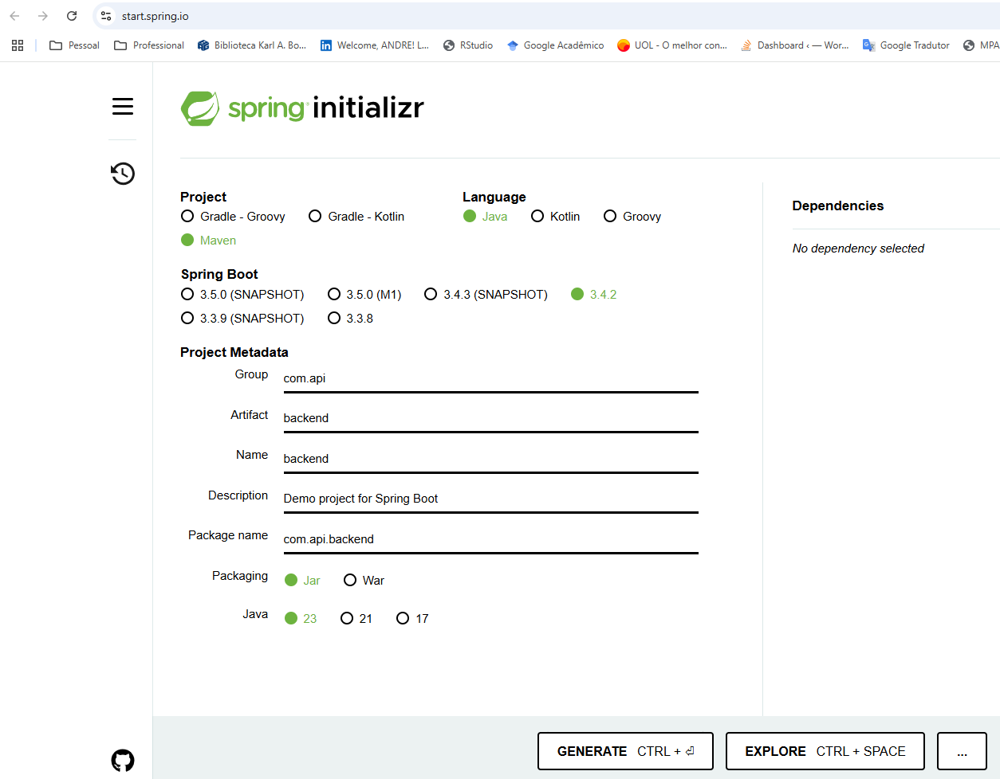

## Memória de comandos

```powershell
mkdir backend
```
```powershell
cd backend
```
## Spring

```powershell
# não deu certo
Invoke-WebRequest "https://start.spring.io/starter.tgz?dependencies=web&type=maven-project&groupId=com.meuprojeto&artifactId=backend" -OutFile backend.zip
Expand-Archive -Path backend.zip -DestinationPath backend
```

Como esse passo acima não deu certo, usei um novo caminho criando um projeto Spring Boot no site [spring initializr](https://start.spring.io/). Segue os parâmetros que eu preenchi:




Na pasta backend eu rodei:

```powershell
# Para o Maven compilar o projeto
mvm clean package
```

```powershell
mvm spring-boot:run
```

Agora acesse o link (http://localhost:8080/api/hello) e você verá a mensagem: "Spring Boot funcionando".

```ts

backend/
│── src/
│   ├── main/
│   │   ├── java/com/exemplo/auth/
│   │   │   ├── config/
│   │   │   │   ├── MongoDBConfig.java
│   │   │   │   ├── MySQLConfig.java
│   │   │   │   ├── PostgreSQLConfig.java
│   │   │   │   ├── RedisConfig.java
│   │   │   ├── controller/          # Endpoints REST (Login, Registro, etc.)
│   │   │   │   ├── ConnectionTestController.java
│   │   │   ├── model/               # Modelos do banco de dados (JPA)
│   │   │   │   ├── UserRepository.java
│   │   │   ├── service/             # Lógica de autenticação e cache
│   │   │   │   ├── AuthService.java
│   │   │   │   ├── TokenService.java
│   │   │   ├── dto/                 # DTOs para requisições e respostas
│   │   │   │   ├── UserDTO.java
│   │   │   ├── security/            # Configurações de segurança (JWT)
│   │   │   │   ├── JwtUtil.java
│   ├── resources/                   # Arquivos de configuração
│   │   ├── application.yml (Opcional)
├── pom.xml                           # Dependências do Maven
└── Dockerfile                        # Arquivo Docker para containerizar a aplicação


```

## Testes no Postman

Para a realização dos testes no `Postman`, você deve usar os seguintes endereços:

```ts
# GET
http://localhost:8080/test/postgres
```

```ts
# GET
http://localhost:8080/test/mongo
```

```ts
# GET
http://localhost:8080/test/redis
```

```ts
# GET
http://localhost:8080/test/mysql
```

## Rotas disponíveis

<div align="center">

|                                                                    Tipo | Rota                     | Ação                               |
| ----------------------------------------------------------------------: | :----------------------- | :--------------------------------- |
|  <hr>                                                                   |  <hr>                    | **Controle de usuários**       |
|    []() | `http://localhost:8080`                | Listagem de usuários               |
|    []() | `http://localhost:8080/buscar-id/1`            | Dados de um usuário específico     |
|   []() | `http://localhost:8080/cadastrar`          | Cadastro de usuários               |
|    []() | `http://localhost:8080/atualizar-id`          | Alteração dos dados do usuário     |
| []() | `http://localhost:8080/2`     | Exclusão de usuários               |

